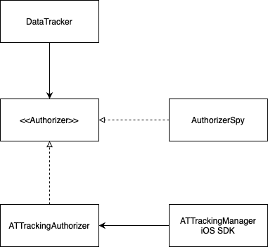

# DataTrackerAuthorizer

## Overview
Illustrate how to prove if your code calls valid methods from the iOS SDK by wrapping them into implementation hidden by the protocol.

This repository checks user responses from the [App Tracking Transparency](https://developer.apple.com/documentation/apptrackingtransparency) prompt. The test suite can be valuable for your project since ATT manual tests are frustrating, making mistakes easy.

Such an approach will also be helpful when you need to test behavior from external libraries (ex. Firebase Analytics).

## System architecture

